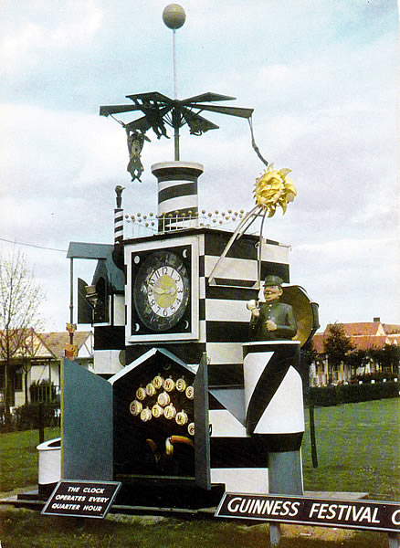

## New York University Abu Dhabi    
## Interactive Media Program    
## Course title: Machine Lab  
Course number: IM-UH 2113  
Section: 1    
Credit Hours: 4         
Prerequisites: None       

Shortcut to [today's lecture](lectureNotes.md/#todays-lecture)  
Shortcut to [today's assignment](homework.md#todays-assignment)  

Course website: [https://github.com/michaelshiloh/MachineLab](https://github.com/michaelshiloh/MachineLab)      
Instructor: Michael Shiloh mshiloh@nyu.edu    
Office hours: If you want to meet schedule an appointment [here](https://calendly.com/michaelshiloh/office_hours)

Meeting times:    
	2:10 PM - 3:25 PM Monday  
	2:10 PM - 4:50 PM Wednesday  
Session: Spring 2024  
Class location: C3-029 (IM Lab)  
- [Lecture notes](lectureNotes.md)
- [Previous sessions](previousSessions/previousSessions.md)

**Everything here is subject to change**


This document: Lecture Notes

## Week 1 

## Monday 22 January 2024
### Plan for today
- What is the class about
- Rules and Logistics
- Introduction to Arduino
- Homework

### What is this class about
- Machines: building them, using them
- Mechanics (statics and dynamics)
- Design
- Creativity
- History and critique of technology

Inspiring examples
- [Astronomical clock
	Prague](https://www.prague.eu/en/object/places/3129/astronomical-clock)
- [Clock with Dancing Figures, Spinet and Organ](https://www.youtube.com/watch?v=nlPHd1ezgL4), 1625
- [Männleinlaufen, Church of Our Lady, Nuremberg](https://www.youtube.com/watch?v=zgMsNExH2-c)
- [Elephant Automaton Clock, 1600–1625](https://www.luc.edu/luma/collections/martindarcysjcollection/elephantautomatonclock/ )
- [1001 Inventions](https://www.1001inventions.com/feature/top7clocks/)
- [Famous Mechanical Clocks in Europe](https://trendingtravel.org/famous-mechanical-clocks-in-europe/)
- [Anker Clock](https://www.wien.info/en/sightseeing/sights/from-a-to-z/anker-clock-339092)
- The Guinness Festival Clock series
	- 
	- [The Guinness Clock in Battersea Park](https://vimeo.com/89823385)
	- [Description](https://www.guinntiques.com/festivalclock.aspx)
- Tim Hunkin
	- [Southwold
	waterclock](https://www.timhunkin.com/63_southwold_water_clock.htm)
	- [Exploratorium](https://www.exploratorium.edu/video/tim-hunkins-tinkerers-clock)
	- Tim's [other clocks](https://www.timhunkin.com/control/d_clocks_index.htm)
- Wikipedia entry on [Automaton Clocks](https://en.wikipedia.org/wiki/Automaton_clock)


### Class rules

This class is fast-paced, difficult, and time consuming. You will have to
learn many skills that are new to you, and you will spend many, many hours
working on your assignments.  You are all top students, otherwise you wouldn't
be at NYUAD. You have gotten here because of your excellent academic skills.
You are used to estimating how long an assignment or project will take based
on your past experiences.  Physical computing involves skills which are
probably new to most of you: mechanics and physical construction.  When the
assignments require skill with which you have little experience, your
time estimates can be very, **very**, *very* wrong.  

I can almost guarantee that you will spend much more time on this class than
you think. Don't take this class if you aren't prepared to work hard and
invest the necessary amount of time.

On the other hand, I am here for you. I want to see you succeed. I like seeing
your projects succeed. You will find me very accessible and helpful. I am
online at all hours and can often solve problem via Discord. I'm also very
available in person and spend much time outside of class in the IM lab or in
my office. You can approach me at any time, but *you* must take the initiative
and reach out to me, and you must not wait until the last minute. You must try
seriously to solve your problems, and if you can't solve them, you must reach
out to me while there is still time for me to help you.

In return I have expectations of you: I expect you to come to class on time
and to be fully present. I expect you to be fully engaged in the course, and to
fully participate in and contribute to class discussion. I expect you to work
hard, very hard, to try to solve problems on your own, and to ask me for help
when you run into trouble. 

I am deeply committed to teaching. I expect you to be fully engaged in this
class. If you are not interested in this material and are taking this class
strictly to fulfill a requirement, I urge you to drop this class and allow
someone who is interested take your place.

I do not tolerate the use of cellphones, earphones, watches, or laptops in
class for anything other than what we're actively working on.  If you need any
exceptions, talk to me.  

I strongly recommend that you take notes on paper.  In particular, when I help
you, I like being able to make notes on paper, so I require that each of you
will have a notebook on hand when you ask for my help.

I understand that there is more going on in your lives than this class.  If
there is stuff going on that is making it difficult to get your work done,
contact me and we'll work something out.  Email is appropriate for these
discussions.

One last thing: I don't want to get sick.  If you're feeling sick, please stay
at home.

#### Logistics

Each of you will write a paper and make a presentation related broadly to the
topic of this class.

This course requires training on different tools. Training is offered only at
certain times, and the training staff does not have the resources to offer
training at other times. You must attend the training sessions unless there
is some truly exceptional reason not to do so. 

You may require separate training for your particular project (e.g. sewing or
welding). You will be responsible for reaching out to the relevant shop to
arrange such training.

You are encouraged to use Discord to ask all questions related to class,
whether technical, logistic, or otherwise. Reserve email for personal matters.

#### Cleaning up

We will be building things. We will use lots of tools and materials. It is
your responsibility to clean up after yourselves, to return tools and
materials to their places, and to put trash and recycling in the appropriate
bins.

Some of the tools and materials are for the exclusive use of our class; others
are generic tools and materials used by other classes. You must return things
to their proper place.

In summary:

- *Always* clean up after yourselves, and always clean up a little more than
	whatever you left. Leave the space cleaner than you found it. Failure to do
	so will result in a lower grade.
- Return tools and unused materials to their proper places
- Discard trash and recycling in the proper bins
- Keep our tools and materials in our space
- If you see anyone outside of our class using our tools, materials, or space,
	please get their names and inform me.

### Homework

All homework will be given in the [homework](homework.md) file. It is your
responsibility to know what's due. I will send a message on Discord and
Brightspace whenever I make a change.

### Introduction to Arduino

- Upload the Blink example
- Change the parameter in delay()
- Upload again and verify that the LED blinks at the new rate

Discuss

- What's going on here?
- What role does Arduino play?
- LEDs and other actuators
- What is the opposite of an actuator?
- Reading from a sensor vs. writing to an actuator

## Wednesday 24 January 2024
### Plan for today
- Last year's project
- Breadboard circuits
- Soldering 
- Theme

### Last year's project
- Visit
- Theme
- Inspect
    - Mechanisms
    - Construction Techniques
- Document
- Disassemble

#### Breadboard Circuits

The most confusing part of this lecture will be the solderless breadboard:

Image courtesy of
[SparkFun](https://learn.sparkfun.com/tutorials/how-to-use-a-breadboard/all)

Let's extend our blinking LED to the breadboard:


#### Review
- Code or program
- Circuit
- Input and Output (I/O) pins
	- 20 IO pins
	- All 20 pins can do digital input and digital output
	- Many of the pins have additional special functionality
- Built-in LED
	- On the Arduino Uno this LED is on pin 13
	- On the Arduino Uno LED_BUILTIN = 13 

#### Schematics
- Schematics are ways to capture the important features of a circuit
	without getting distracted by details (e.g. subway maps)
- What's important in an electrical circuit?
	- Where is the power coming from?
	- What other components are there in the circuit?
	- How are they connected?
- Schematic for the circuit we built above
- Schematic conventions
    - Positive voltage on top, ground at the bottom
    - Inputs on the left, outputs on the right
        - Information flows from left to right
    - Unused pins can be left off
- Schematics are an important way to show a circuit. You will be required to
  understand and use them

#### Analog Output

- Analog output uses the `analogWrite()` function
- The `analogWrite()` function only works on the six PWM pins (3, 5, 6, 9, 10,
  and 11).
- Usually only suitable for LEDs and motors

Your turn:
- How can we modify our circuit to test an analog output?
- How can we modify the `blink` program to test the `analogWrite()` function?

#### Analog Input

Build this circuit. Try to follow the schematic and not the breadboard view:


- Analog Inputs, `analogRead()`, and (some) sensors go together
	- `analogRead()` only works on the six analog input pins (A0-A5)
        - In contrast, `digitalRead()` works on all 20 pins
        - Digital sensors, like a switch, have only one of two values 
        and so are more suited to a digital input
- Remember that the so-called analog input pins can do digital input and
	output as well
- Since you have so few analog input pins, when you decide which pins to use
	for which device, reserve the analog input pins for analog input devices
	as much as possible

## Monday 29 January 2024
### Plan for today
- Theme
- Programming
- Servo motors


#### Theme

- Water: A potential theme for the clock can be around bodies of water, marine
  life, coral reefs, and anything related to underwater life.
- Nature: The clock can be themed around nature that draws inspiration from
  elements such as waterfalls, mountains, forests, and wildlife.
- Global Cultures: As NYUAD is a diverse community the clock can encompass
  this diversity. Each group can be in charge of representing a specific
  culture by using’s symbols, landmarks, and other related elements to that
  specific culture.
- Alice in the wonderland
- hour before the deadline
- lifecycle (of a plant/bug/human/etc)
- Nature/Flower Field- mood board with some aesthetic art pieces as an
  inspiration.
  ([example](https://www.pinterest.ca/gabitayazhan/flowernature-moodboard/)
  Each scene could have some different flowers moving, butterflies flying and
  a forest scene with other animals, and so on.
- 12 hours-12 Zodiac Signs. Inspiration from the [Dior clock in NYC](https://www.youtube.com/watch?v=Lds3eUNVZXU). [Article](https://www.timeout.com/newyork/news/heres-why-theres-a-giant-zodiac-display-on-the-saks-fifth-avenue-facade-102023)
- University life/Life at NYUAD- depicting everyday scenes that the audience
  could relate to e.g.  8am could be
  waking up in a hurry and running to a class.  1pm-going to lunch with
  friends at d2.  4pm-playing with cats.  22pm-cramming and studying hard at
  the library
- Windows Outside - looking into a window and out at the same time
- Snow Globe - a microcosm of a small scene
- Waves - exploring rhythm and movement in machines (clockwork)
- nature in the desert
- a linear story (with a character moving through different elements of the
  clock, e.g. Hugo Cabret) 
- a hotel with different elaborate rooms, e.g. The Grand Budapest Hotel
- Golden Sands: The clock design features a vast expanse of golden sands with
  occasional palm trees swaying in the breeze. The sun (with leds behind) will
  move over the clock to indicate time, with its brightness (and colors)
  change according to the time of the day. At night, moon takes its place and
  moves across the clock to indicate time. The sand background, at night, also
  changes color to show moonlight.
- Dhow and Waves: Daytime: The clock showcases a seascape with traditional
  dhows sailing on calm waters. The clock hands could be replaced by miniature
  dhows, moving to indicate the time. Nighttime: The scene transitions to a
  moonlit ocean, and the clock hands transform into waves. Soft reflections on
  the water highlight the nighttime hours.
- Arabian Nights: The clock features a bustling market scene inspired by UAE
  folklore, with characters from local tales and legends. Iconic characters
  like "Juha" and "Umm Duwais", or certain mythical elements, places, etc.
  could be depicted. The sun in the day and moon in the night, shaped like a
  mystical symbol from folklore, moves across the sky to indicate the time. We
  can also incorporate interactive elements, like for certain hour(s) only a
  certain character appears, and touching that character (or pressing some
  button) would narrate its short story.
- Nature and Technology: Inspired by Nam-June Paik's TV Garden, I think it
  would be really interesting to have a clock that utilizes plants alongside
  an Arduino. Perhaps the clock can utilize the plants in some way, or have
  timed watering or something like that.
- Time Zones: I think an interesting idea would be to explore the idea of
  different time zones all over the world. While it may be day time in the
  UAE, it could be evening or night in another country. Making parts that
  represent the time of day of other countries could be interesting, having a
  true world clock.
- Music: I love music, so I will always be interested in implementing music
  into a project in some kind of way. Perhaps we could use the Arduinos to
  create user-interactive musical modules, or ones that could play at certain
  times of day, similar to church bells ringing at certain times of the day.
  Having a clock where the minute and hour hands are the black and white piano
  keys sounds interesting to me.
- Theme Park: Imagine a clock with a mini roller coaster, figures screaming in
  fear, swings of death, and slow rivers. We will make our audience wish they
  could attend the MachineLab Land Park! 🎢
- Mini IM Showcase: This clock's theme will be an ode to our journeys in the
  IM department. Each team would chose a project they worked on during their
  time here and make it the theme of their part. This would make a mini IM
  showcase within the IM showcase!! 🤖
- MachineLab Cafe: What if we all owned a cafe together. The clock would be
  the center piece of our cafe and each piece would correspond to a step in
  the coffee value chain. (i.e coffee farmers picking the beans, roasting,
  shipping). Maybe even one part could pour actual cold brew coffee. 🧋
- NYU Abu Dhabi:
- Represent the 4-year cycle that students go through. The storyline goes from
  admissions/Marhaba through studyaways, J-terms, and other components of the
  NYUAD experience, and ends with commencement. We can incorporate a lot of
  different references to the campus such as the palms, d2, flights, the
  library, etc.
- Astronomy/Space: Create a clock with many different astronomical references
  such as the constellations, the planets, the satellites, and different space
  exploration components. We can have the first moon landing as one of the
  historical moments to represent in the clock.  Disco:
- Make the clock very unserious and shiny, disco-inspired with a big disco
  ball and a lot of light and musical elements.
- The time travel (from the ancient times to nowadays: ancient Egypt,
  First/Second Industrial revolution, 60s and 70s, modern world, future)
- The future (we can each create a part how we imagine the world will be in a
  couple of years, some fantasy)
- Parts of the world (As we are from different countries we can collaborate to
  recreate each continent of the earth)
- Quantum Mechanics Theme
- Space Exploration Timeline Clock
- Ancient Greek Theme
- Inspired by famous paintings or artworks e.g. starry night
- Nature: plants, flowers and trees
- Music: sound made by objects like marbles etc
- Greatest Games through the years (Personal Favorite) This theme celebrates
  the evolution of video games. Each segment represents a different era in
  gaming history, featuring iconic games like Pac-Man, Super Mario Bros,
  Pokémon, GTA, Among Us, etc. The design mimics an arcade, complete with
  pixel art and game sound effects, creating a nostalgic and immersive journey
  through the most influential games of each period.
    - The space below the clock can have a loading bar that gets filled up
      from one side to the other as we move through the different ages of the
      games.
- Cosmic Voyage Clock This concept visualizes the history of the universe in
  an hour. It begins with the Big Bang and progresses through major cosmic
  events, transitioning to significant moments in Earth's history, possibly
  including the formation of the solar system, the emergence of life, and key
  milestones in human development. It's a grand depiction of time on a cosmic
  scale.
- Musical Eras Symphony This theme takes viewers on a journey through the
  history of music. Each segment of the clock represents a different musical
  era, from classical compositions to modern electronic music. The transitions
  are marked by iconic melodies or instruments characteristic of each period,
  providing a harmonious and educational exploration of musical evolution.
- nature - activities of volcano

#### Programming

- `map()`
- `constrain()`
- `if()`
- Getting information from Arduino
    - `Serial.println()`
    - Must be initialized `Serial.begin()`

Example using an analog input to control the brightness of an LED

````
const int LED_PIN = 3;           // the PWM pin the LED is attached to
const int POT_PIN = A2;
int brightness = 0;    // how bright the LED is

// the setup routine runs once when you press reset:
void setup() {
  // declare pin 9 to be an output:
  pinMode(LED_PIN, OUTPUT);
  Serial.begin(9600);
}

// the loop routine runs over and over again forever:
void loop() {
  int pot_value = analogRead(POT_PIN); // 0-1023
  brightness = map(pot_value, 0, 1023, 255, 0);
  Serial.println(brightness);
  analogWrite(LED_PIN, brightness); // 0-255
}
````
#### Digital Input

Adding a switch


````
void setup() {
  pinMode(8, OUTPUT);
  pinMode(13, OUTPUT);
  pinMode(A2, INPUT);
}

void loop() {

  int switchPosition = digitalRead(A2);

  if (switchPosition == HIGH) {
    digitalWrite(8, HIGH);   // turn the LED on (HIGH is the voltage level)
    digitalWrite(13, LOW);
  } else  {
    digitalWrite(8, LOW);    // turn the LED off by making the voltage LOW
    digitalWrite(13, HIGH);
  }
}
````

An example:

````

const int pushButton = A2;
const int redLEDPin = A0;
const int greenLEDPin = 8;

void setup() {
  pinMode(redLEDPin, OUTPUT);
  pinMode(greenLEDPin, OUTPUT);
}

void loop() {

  int buttonState = digitalRead(pushButton);

  if (buttonState == HIGH) {
    digitalWrite(redLEDPin, HIGH);
    digitalWrite(greenLEDPin, HIGH);
    delay(500);
    digitalWrite(greenLEDPin, LOW);
    delay(300);
    digitalWrite(redLEDPin, LOW);
    digitalWrite(greenLEDPin, HIGH);
    delay(700);
  }
  allOff();
  delay(1000);
}

void allOff() {
  digitalWrite(redLEDPin, LOW);
  digitalWrite(greenLEDPin, LOW);
}
````

#### Servo motors

- [Schematic](https://www.arduino.cc/en/Tutorial/Knob)
- [Reference page](https://www.arduino.cc/en/Reference/Servo)

## Wednesday 31 January 2024
### Plan for today
- Theme: start thinking
- Giant Servo motors
- Power supplies
- Research topics
- Theme: tentative teams

##### Giant Servo motors

Torque: The ability to lift a certain weight at a certain distance from the center
- [Tower-Pro MG-995](https://www.adafruit.com/product/1142)
- ["DS3225 25KG Metal Gear High Torque Waterproof Digital CNC Aluminium Middle
  Shell Red Steering
  Engine"](https://www.amazon.com/DS3225-Waterproof-Digital-Aluminium-Steering/dp/B08RJGVH7D/ref=sr_1_10?th=1)
- ["ASMC-04B Robot Servo High power high torque servo Support 12V~24V
  180kg.cm"](https://www.amazon.com/ASMC-04B-Support-12V-24V-180kg-cm-Quadcopter/dp/B07GDJBDW9/ref=sr_1_fkmr0_2)
  - Note 12-24 volts

[How to configure and
power](https://github.com/michaelshiloh/resourcesForClasses?tab=readme-ov-file#giant-servo-motors-resources)

#### Power supplies

- What is a power supply? How is this different from a converter or an
  adapter?
- What are the important factors of a power supply?
- What is the relationship of voltage to current?
- What does it mean that a power supply has a certain current?

How to use external power supplies, by which I mean how to use power that
doesn't come from the Arduino's 5V pin

## Monday 5 February 2024
### Plan for today
- Theme

### Theme
##### Finalize the theme: THEME PARK!!
##### Teams:
- Roller Coaster: Swostik, Dania, Sunny
- Candy Store: Jackie, Juanma, Aigerim
- Sky Ride: Ronit, Liza
- Swinging Boat ride: Fatema, Salama, Noah
- Carousel: Aya, Evelyn, Ehtisham

## Wednesday 7 February 2024
### Plan for today
- update on teams
- motors, mechanisms, and assembly techniques

## Monday 12 February 2024
### Plan for today
Review homework, discuss problems, discuss solutions

- Carousel: Aya, Evelyn, Ehtisham
slipring
stepper motor
- DC motor with tire
- piece of wood

- Swinging Boat ride: Fatema, Salama, Noah
Fatema
neopixels
figures
waves
shells

- Sky Ride: Ronit, Liza
- 10rpm motors
- clouds
crank? individual servo motors
thin flexible wires


- Candy Store: Jackie, Juanma, Aigerim
lazy susan
tree
stepper motor or DC motor
how to animate the lolypops
where to hide the motor
do we need the lazy susan


- Roller Coaster: Swostik, Dania, Sunny
how to get the roller coaster car up the slope
- motor heat
- proximity of magnet to car
- multiple magnets
- belt

## Wednesday 14 February 2024
### Plan for today
Tool training

## Monday 19 February 2024
### Admin
### Plan for today
- Presentations
- Working with metal
- Parts and box redistribution 
- Field trips to AMW, ERB
- Review homework 

## Wednesday 21 February 2024
### Plan for today
Work day!

## Monday 26 February 2024
### Plan for today
1. Class will meet behind C2, near the path to the north field, 
at our usual class time of 2:10 
1. Please select your time slots for your presentations
   [here](https://docs.google.com/spreadsheets/d/19HCuk5-NCF-PobeBE8HsrbsLqfSdZQaEY3s8nDGBKpI/edit?usp=sharing)

## Wednesday 05 March 2024
### Plan for today
- Homework
- Fix presentation schedule
- Advanced Manufacturing Workshop: Jorge Montalvo Navarrete jmontalvon@nyu.edu

##### Homework
- I'm not going to assign homework every week but I want you to update your
  journals at least once a week before Sunday at 5pm
- You will not finish your project on time if you only work on Wednesdays.
  You must manage your own schedules and find time outside of class to work on
  your project.

##### Fix presentation schedule
- [Schedule](https://docs.google.com/spreadsheets/d/19HCuk5-NCF-PobeBE8HsrbsLqfSdZQaEY3s8nDGBKpI/edit?usp=sharing)
- Swap conflicts
- added a week

## Monday 25 March 2024
### Plan for today
- presentations
    - Juanma
    - Liza
    - Aigerim
    - Aya

## Wednesday 27 March 2024
### Plan for today
- Sound
    - Adafruit Music Maker Shield
    - Loudspeaker
- Mounting electronics
    - Arduino + any shields
    - L298 Motor Driver
    - Loudspeaker
    - Anything else?
- Wiring
    - Power!
        - 5V for Arduino
        - 12V motors
        - 24V motors
        - 5V for Neopixels and "standard" servo motors
- Pins
    - Music Maker Shield uses 13, 12, 11, 7, 6, 4, 3
    - L298 can use any pins, but for speed control need PWM 5, 9, 10
        - let's say 9 and 10 for PWM, and 2, 8 for the others
    - Servos and Neopixels can use any 
        - that leaves 5 and the analog input pins for servos, neopixels, and
          interfacing with the master clock
- Control software
    - Initiating your activity
    - Blocking vs. non-blocking functions
    - Doing multiple things at the same time (multitasking)
    - Sample code [musicShieldAndMotor](https://github.com/michaelshiloh/MachineLab/blob/master/src/musicShieldAndMotor/musicShieldAndMotor.ino)


- Schedule
    - 27 (today)
    - 3
    - 10
    - 17
    - 24
    - 1
    - 8 -> 10


Bonus link:

[Adafruit Multitasking Tutorial](https://learn.adafruit.com/multi-tasking-the-arduino-part-1?view=all)
for doing multiple things at the same time (e.g. moving a servo, dimming a Neopixel) 

## Monday 1 April 2024
### Plan for today


Presentations! Aigerim, Juanma, Aya, Sunny

## Monday 22 April 2024
### Plan for today

Presentations! Ehtisham, Evelyn, Salama, Noah

###### Schedule for the rest of the semester:

* April 24 Wednesday: demonstrate button operation
* May 1 Wednesday: Test operation in the frame with the control computer
* May 1 - May 6: Finish technical work
* May 6: Return projects to the finished frame, test entire system
* May 6 - May 8: Decorations, painting, aesthetics, etc.
* May 8: Return projects to the finished frame, verify entire system

## Monday 28 April 2024
##### todays-lecture
### Plan for today

- Presentations! Fatema, Ronit, Ronit, Dania
- A few words about your projects
- Your opinion matters

#### A few words about your projects
- Don't solder wires directly to the Music Maker Shield. You should solder
  wires to a prototyping shield, and plug the prototyping shield into the
  Music Maker Shield. 
- Always use stacking headers in all your shields
- Never use the jumper wires. They are too thin and will tear easily
- Never use solid core wire except going from point to point on the same
  board.
- Never use copper tape to make any connections. It is unreliable
- use enough heat shrink tubing to completely cover any joints. If it shrinks
  and leaves a gap, put another piece over that. Heat shrink tubing is cheap,
  fixing a short circuit is not.
- I warned you at the beginning of the semester that this class will require a
  lot of work and that you would have to put in a lot of time outside of class
  time.
- Homework for Wednesday

#### Your opinion matters
- Should this be a clock or not?
- Decorations?
