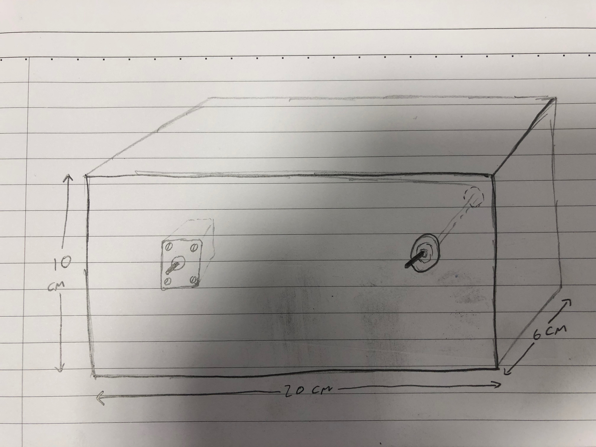
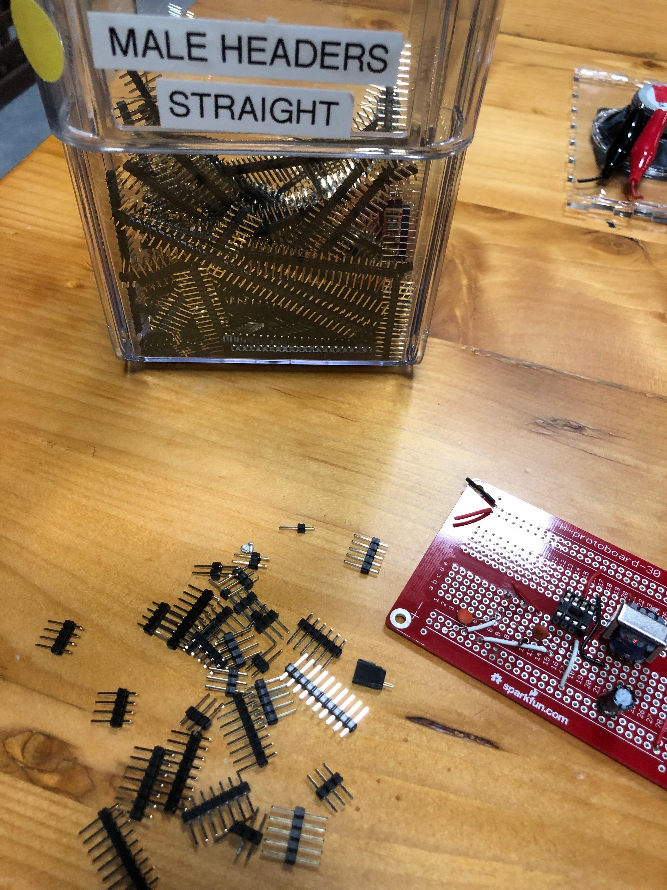
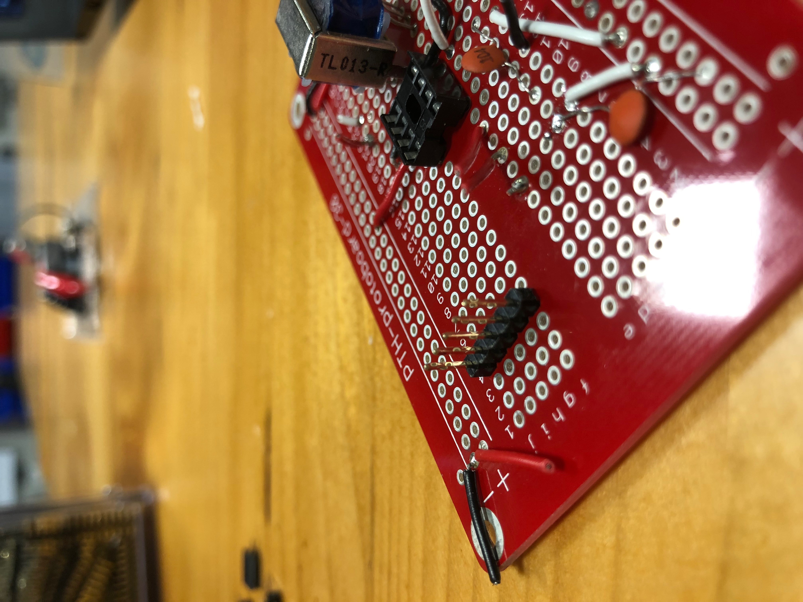
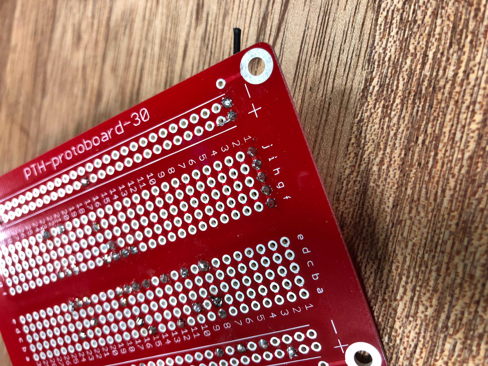

## New York University Abu Dhabi
## Interactive Media
# Machine Lab
### Course Number: IM-UH 1112
### Spring 2019

**Everything can be found on the course website:**
[https://github.com/michaelshiloh/MachineLab](https://github.com/michaelshiloh/MachineLab/)

Quick
[link](https://github.com/michaelshiloh/MachineLab/blob/master/schedule.md#current-homework-assignment)
to current homework assignment

### Schedule Overview

This schedule is subject to change

Week 1 January 30, February 4 - Hand crank automata   
Week 2 February 6, February 11 - DC motors, soldering, motorized automata    
Week 3 February 13, February 18 - Arduino, Fusion 360, laser cutter
Week 4 February 20, February 25 - Servo motors, stepper motors, motor shields
Week 5 February 27, March 4 - Solenoids, start work on drawing machines
Week 6 March 6,  March 11 - Drawing machines, construction techniques   
Week 7 March 13,  March 18 - hand tool training
Spring break   
Week 8 April 1, April 3 -  Scene ship training, marble elevators   
Week 9 April 8, April 10 - Scene ship training, marble elevators   
Week 10 April 15, April 17 - Scene ship training, marble elevators, Rube Goldberg   
Week 11 April 22, April 24 - Rube Goldberg, manual reset   
Week 12 April 29, May 1 - Rube Goldberg, manual reset   
Week 13 May 6, May 8 - Rube Goldberg, automatic reset   
Week 14 May 13, May 15 - Rube Goldberg, automatic reset   
   
May 16 End of semester show?   


### Detailed Schedule

This schedule is subject to change

#### Wednesday 30 January 2019 11:50 AM - 1:05 PM
- What this class is about (schedule)
- Introductions
- Syllabus
- Summary:
  -  Be present and participate in class
  -  No electronic distractions
  -  Be proactive: Communicate with me regarding difficulties, problems, illness, etc.
  -  Allow lots of time for homework as physical construction
  and debugging circuits and programs can be very time consuming.
- Announcements
  - Become a lab assistant! The application deadline is Feb 3rd at 11:59 pm.
    It's on CareerNet, or contact Ume (uh242@nyu.edu)
- Examples
	- [Simple Cardboard Machines](https://vimeo.com/130539503)
	- [Drawing Machine](http://www.shihanzhang.com/drawing-machine/)
	- [Musical Instrument](https://vimeo.com/189366071)
	- [Chain Reaction](https://vimeo.com/102887278)
	- [Marble
		Machine 1](https://www.pinterest.cl/pin/481251910156036553/visual-search/?x=12&y=12&w=405&h=512)
	- [Marble Machine 2](https://www.youtube.com/watch?v=09BVLbyWAqQ)
	- [Marble Machine 3](https://www.youtube.com/watch?v=Bpdb8yQ9cH8&t=28s)
	- [Machinations-Mechanisms](https://github.com/michaelshiloh/resourcesForClasses/blob/master/doc/machinations-mechanisms.pdf)
	- [Creative Machine Lab at Columbia University](http://www.creativemachineslab.com/)
	- [Rolling Ball Machine made of Bicycle Junk](https://www.youtube.com/watch?v=Bpdb8yQ9cH8)
	- George Rhoads' [Ball Machines](http://georgerhoads.com/)
	- Creative Architecture Machines [here](http://www.creative-architecture-machines.net/) and [here](http://www.future-cities-lab.net/blog/2013/11/3/creative-architecture-machines-cca-fall-2013)
	- Harvey Moon's [Drawing Machines](https://creators.vice.com/en_au/article/nz4jj7/harvey-moons-drawing-machines)
	- Jean Tinguely
	- [Alan Rath](http://alanrath.org/)
	- John Cage
	- [Theo Jansen](http://www.strandbeest.com/)
- Demo
- Let's start making something


#### Homework due Monday February 4 
- **Read**
	- [Machinations-Mechanisms](https://github.com/michaelshiloh/resourcesForClasses/blob/master/doc/machinations-mechanisms.pdf)
	- [Basic
		Mechanisms](https://web.archive.org/web/20170727010622/http://www.mechanical-toys.com/mechanisums.htm)

- **Do**
	- Build a hand crank machine using a crank and any other mechanism (linkage,
	cam, etc. Your machine must operate smoothly without sticking or falling
	apart for at least 30 seconds. 

- **Optional**
	- Browse [Mechatronics
 Resources](https://github.com/michaelshiloh/resourcesForClasses#mechatronic-resources)

#### Monday 4 February 2019 10:25 AM - 1:05 PM

**Share Projects**
- What did you learn?
- Critique

**Administration**
- Add Github accounts
- Label shelves
- Homework is not optional

**Good lab citizenship**
- It is super critical to keep tools, parts, and the lab in general neat.
- If tools or parts can't be found it's the same as them not existing and it
	holds everyone up including me
- If you don't know where something goes ask me or a lab manager or a lab
	monitor. If no one in the lab knows leave it on your shelf and send me
	email.
- Always (**Always!**) leave the lab cleaner than you found it. Clean up 
whatever mess you made, and a little more
- We are going to be making most stuff than any other class, so if there
    is a mess, everyone will know it's us.
- If I find out that you are being a bad lab citizen, it will affect your
	grade

**Demo**
Soldering
- wires to wires
- wires to boards
- wires to motors

**Demo**
Using 5V from Arduino to power motor


#### Homework due Wednesday February 6
- Practice soldering until you feel confident
	- Wires to wires
	- Wires to boards from the scrap board box
- When you feel confident, get a motor and solder wires to it
	- Make sure you are using **stranded** wires! Ask if you are not sure!
	- Use any two color you wish **except** red and black

#### Wednesday 6 February 2019 11:50 AM - 1:05 PM

**Check in**
- Who did not solder wires to their motors?
- Who used solid core wire instead of stranded wire?

**Lecture** 
- Introduction to Electricity
- How to use Arduino as a power supply for your motor
	- **Be very careful not to let the wires touch any other parts of your board
		as this may cause a short circuit**

**In Class Activity**
- Distribute Arduino and USB cables
- Twist strands tightly
- Insert wires into Arduino carefully
	- **Be very careful not to let the wires touch any other parts of your board
		as this may cause a short circuit**
- Connect Arduino to your laptop via USB
- Observe motor turning
- High five your neighbor
- Disconnect USB to stop the emotor
- Add wheels (be aware that motor will turn and try to run away)
- Re-connect USB to start the emotor

**Demo** (time permitting)
- Solder a small length of **solid** core wire to the end of your **stranded** wire to make it easier to insert into your Arduino

#### Homework due Monday February 11

- Mount motor to your project to make it turn
	- It must turn for 30 seconds without breaking
	- You may need to strengthen or even rebuild your project
- Download the Arduino IDE (ARDUINO 1.8.8) from
    [here](https://www.arduino.cc/en/Main/Software)
    Scroll down past the "Arduino Web Editor" to "Download the Arduino IDE". Select the appropriate download (if you are on Windows you probably want the Windows Installer). On the next page you will be asked if you want to contribute to Arduino Software. Scroll down a little and you will see a button that says "Just Download".
  - Try to install it if you can but don’t worry if you have trouble.
    We’ll do that in class.

#### Monday 4 February 2019 10:25 AM - 1:05 PM

**Demonstrate projects**
Take pictures and videos and post on your page!

- Introduction to Arduino
	- What makes up an interactive system
		- Inputs and sensors
		- Outputs and actuators
		- Microcontrollers
		- Pins
	- Test Arduino
		- Blink
	- Inputs and outputs, digital and analog (and other)
- Other motors
	- DC
		- Open loop vs. closed loop


#### Homework due Wednesday February 13

- Create a GitHub account and create a repository for this class. 
	[Here](https://github.com/michaelshiloh/resourcesForClasses#github-resources) are some instructions
	Your account name can be something like your name (mine is michaelshiloh)
	The repository name should be something like "MachineLab" (no spaces are allowed)

- Take the pictures and video discussed below but don't bother uploading them to Github. We will do that in class.
	- Clear pictures of your project 
		- At least 2 pictures of the overall project
			- Front 
			- Back
		- At least 4 pictures detailing the mechanism
			- Cam or rotating mechanism
			- The attachement of the mechanism to the motor wheel
			- The mounting of the motor to the base of you project
			- The final piece that is rotated, liftied, or otherwise manipulated
	- A short video (about 10 seconds) of your project running

- Read [Sparkfun Motors and Selecting the Right
	One](https://learn.sparkfun.com/tutorials/motors-and-selecting-the-right-one) tutorial

#### Revised Homework due Monday February 18

- Read chapters 1-6 of "Making Things Move"

- Watch
	[these](https://www.lynda.com/Fusion-360-tutorials/Fusion-360-Essential-Training/614292-2.html) Lynda video tutorials on Fusion 360: (less than 20 minutes
	total):
	- 3.1 User Interface Overview
	- 3.2 Navigating inside F360
	- 3.3 Model Environment
	- 3.5 Sketch Environment
	- 4.1 Extrude a 3D object
	- Optional
		- 4.4 Add or Subtract objects from other objects
		- 8 Introduction to sketching: Raspberry Pi Case
	
- Download and install Fusion 360, either
	- Free [30 day
		trial](https://www.autodesk.com/products/fusion-360/free-trial)
	- Make a [student
		account](https://www.autodesk.com/products/fusion-360/students-teachers-educators) and get a free 3 year license

- Try to design a box into which you can mount a [Nema 17
	motor](https://www.adafruit.com/product/324) and two
	[flanged
	bearings](https://openbuildspartstore.com/flanged-bearing-688zz-8x16x5/)
	
	- You will need to determine the positions and size of the mounting holes
		and the shoulder around the shaft so that the motor can be mounted in your
		box. Use [this](https://reprap.org/wiki/NEMA_17_Stepper_motor) 
		for the standard Nema 17 dimensions. 
	- The bearings are there to support a
		[shaft](https://www.servocity.com/5mm-stainless-steel-precision-shafting)  
		that runs through the front and
		back of the box, so the bearing in the back needs to line up with the
		bearing in front
	
- Browse
		[these](https://github.com/michaelshiloh/resourcesForClasses/blob/master/doc/LaserCutBoxNotes.pdf) Laser Cut Box notes  

#### Wednesday 6 February 2019 11:50 AM - 1:05 PM

**Announcements**
- [24x](https://nyuad.im/24x/)  
	In the spirit of Rhizome’s Seven on Seven and Experiments in Art's  Technology’s “9 Evenings”, NYUAD Interactive Media presents The 4th Annual 24X.  

	24X is an event where 10 students from diverse disciplines come together for 24 hours to create something new.   

	In teams of 2, participants will collaborate on an original project of their choice - a game, a performance, a poem, a sculpture, a mobile app - it’s up to the team and their imaginations to decide!   

	After being introduced to each other, each pair will have 24 hours to come up with an idea, prototype it, and present their project to the NYUAD community. Teams will share their process and reflections on the experience.   

	A theme will be revealed at the outset of the event to inspire the work. Faculty mentors will be on hand throughout the event to provide support.   

- Visit to Zimoun's project next Monday at 10:25. Meet in the Art Gallery.
	Attendence will be taken

**Demo and do along with me**
- Github
	- First, let me add all your repositories to our README.md file
	- How to create a file
	- How to create a .md file
	- How to create a folder (directory)
	- [Here](https://github.com/michaelshiloh/resourcesForClasses#github-resources) are some more resources

**Lecture and Demo**

- Hobby servo motors
	- "standard"
	- continuous rotation
	- multi-turn

**Guest Lecture (12:45)**
- Ume and Jack to discuss lab

#### Revised Homework due Monday February 18

- Read chapters 1-6 of "Making Things Move"

- Watch [these](https://www.lynda.com/Fusion-360-tutorials/Fusion-360-Essential-Training/614292-2.html) Lynda video tutorials on Fusion 360: (less than 20 minutes total):

		3.1 User Interface Overview
		3.2 Navigating inside F360
		3.3 Model Environment
		3.5 Sketch Environment
		4.1 Extrude a 3D object
		Optional
		4.4 Add or Subtract objects from other objects
		8 Introduction to sketching: Raspberry Pi Case

- Download and install Fusion 360, either 
	- Free [30 day
		trial](https://www.autodesk.com/products/fusion-360/free-trial) or 
	- Make a [student
		account](https://www.autodesk.com/products/fusion-360/students-teachers-educators) and get a free 3 year license
- Try to design a box into which you can mount a [Nema 17
	motor](https://www.adafruit.com/product/324) and two 
	flanged bearings
	
	- You will need to determine the positions and size of the mounting 
	   holes and the shoulder around the shaft so that the motor can 
		    be mounted in your box. Use
				[this](https://reprap.org/wiki/NEMA_17_Stepper_motor) for the standard Nema 17 dimensions.
	- The bearings are there to support a shaft
		that runs through the front and back of the box, 
		so the bearing in the back needs to line up with the bearing in front

- Browse
	[these](https://github.com/michaelshiloh/resourcesForClasses/blob/master/doc/LaserCutBoxNotes.pdf) Laser Cut Box notes

#### Monday 4 February 2019 10:25 AM - 1:05 PM

- 10:25 - 11:25 Class visit with Zimoun. 
	Please meet outside the Art Gallery's Reading Room at 10:25

- 11:25 - 11:40 break

- 11:40 - 1:05 Fusion 360


#### Homework due Wednesday February 20

- Finish creating your box. Your main file is stored in the cloud
- Export the front surface of your enclosure, 
	which is the surface with all the holes in it, for the laser cutter, using the following steps:
	- Rotate to view the front surface of your enclosure, which is the surface with all the holes in it.
	- Create a new sketch on that surface (Sketch -> Create Sketch)
		- click on the page to open your Sketch Palette
	- Click on "Stop Sketch" without making any chances.
		This "blank" sketch will hold all the created geometry of the solid model when you export it
	- Find that sketch in folder tree on the side. It's probably the last sketch in
		the menu. You can turn each one on and off (click on the lightbulb) to make sure.
	- Right click on the sketch in the folder tree and select "Save as DXF"
	- Upload the .dxf file to your Github account, in a
		new folder called "stepper motor front face"
	- You can see my file in 
		https://github.com/michaelshiloh/MachineLab/tree/master/dxfFiles


#### Wednesday 20 February 2019 11:50 AM - 1:05 PM

- Announcements
	- [24x](https://nyuad.im/24x/)
	- Zimoun workshop Sunday 6pm

- Demo
	- laser cutter

- Stepper motors
	- unipolar
	- bipolar
- How to control motors with Arduino
- Current consumption and current drive ability
	- What is the weakest link?
- Transistors
	- Darlingtons
		- Arrays of Darlingtons (e.g.
			[ULN2003](https://www.seeedstudio.com/document/pdf/ULN2003%20Datasheet.pdf))
- H-bridge
- Motor shield

#### Revised Homework due Monday February 25

**Do**

- Practice soldering wires into boards. Do about 5 wires. Use solid core wire
	from the box labeled Electronic Waste on the wire shelves (left hand side).
	Use scrap boards from the red box on the top shelf of the soldering area.
- Practice soldering bits of male header strips into boards. 
	Use male header strips of about 5 pins.
	Before you cut long headers into bits of about 5 pins, 
	look in the bottom of the 
	male header bin as there are usually shorter bits in there.
	
	Place the header anywhere on the boards that you an find space (it's just
	practice) 
	
	and solder the pins from the bottom as I showed you in class
	
	- Do about 5 strips for practice. Pay attention to getting the strips
		straight.
- Brainstorm some ideas for a "device that leaves mark on a piece of paper".
	You may use any or all of the motors we've learned about: DC gearmotors,
	servo motors (180 degrees or continuous) and stepper motors. On Monday we
	will practice using these motors. Make a sketch (paper and pencil is fine)
	and upload to your github repository.

**Read**

- Review chapter 6 of "Making Things Move"
- Read chapters 7-9 of "Making Things Move"
- Read the [Adafruit Motor Shield
	V2](https://learn.adafruit.com/adafruit-motor-shield-v2-for-arduino?view=all) tutorial

#### Monday 25 February 2019 10:25 AM - 1:05 PM 

- Hand tool training
- Servo motors and stepper motors and motor controller shields 
	- screwdriver for motor shield
- Example drawing machine
	- hub to stepper motor
	- caster support
	- what is wrong
		- caster in wrong place
		- didn't need lift mechanism
		- "towers" aren't stiff enough
		- servo motor draws too much current 
			- Solution: a separate power supply

Here is the code for my drawing machine:


```C++
/*
  Michael's ugly drawing machine
  Based on Adafruit Motor Shield V2 "Stepper test" example
  Based on Arduino servo "sweep" example
*/


#include <Wire.h>
#include <Adafruit_MotorShield.h>
#include <Servo.h>

Servo myservo;  // create servo object to control a servo


// Create the motor shield object with the default I2C address
Adafruit_MotorShield AFMS = Adafruit_MotorShield();
// Or, create it with a different I2C address (say for stacking)
// Adafruit_MotorShield AFMS = Adafruit_MotorShield(0x61);

// Connect a stepper motor with 200 steps per revolution (1.8 degree)
// to motor port #2 (M3 and M4)
Adafruit_StepperMotor *myMotor = AFMS.getStepper(200, 1);

const int LOWER_LIMIT = 45;
const int UPPER_LIMIT = 135;
const int SERVO_PAUSE = 40;


void setup() {
  Serial.begin(9600);           // set up Serial library at 9600 bps
  Serial.println("Stepper test!");

  AFMS.begin();  // create with the default frequency 1.6KHz
  //AFMS.begin(1000);  // OR with a different frequency, say 1KHz
  Serial.println("after afms.begin");
  myMotor->setSpeed(10);  // 10 rpm

  myservo.attach(9);
}

void loop() {

  myMotor->step(50, FORWARD, MICROSTEP);

  for (int i = LOWER_LIMIT; i <= UPPER_LIMIT; i++ ) {
    myservo.write(i);
    delay (SERVO_PAUSE);
  }


  myMotor->step(50, FORWARD, MICROSTEP);

  for (int i = UPPER_LIMIT; i > LOWER_LIMIT; i++ ) { // there is a mistake here - what will happen?
    myservo.write(i);
    delay (SERVO_PAUSE);
  }
}
```


#### Homework due Wednesday February 27

- Identify the riskiest part of your drawing machine and prototype that, using
	any of the motors we have discussed (DC gear motor, stepper motor, servo
	motor)

#### Wednesday 20 February 2019 11:50 AM - 1:05 PM

- Inspect projects
- The digital multimeter
- How to provide external power to your servo motor and stepper motor
	- Diagram of power on motor shield
	- **Polarity is all important! If you get this wrong you might permanently
		damage your motor shield!!** Check the polarity with a multimeter before
		connecting
	- Ask a friend or a lab assistant or an instructor to double check your
		work
	- DC motors and stepper motors can be powered by through 2 position screw
		terminals. **You must remove the shorting block or you might permanently
    damage your Arduino**
		- Check polarity again
	- Servo motors require a little more work
		- Cut the trace on the back of the board as indicated
		- Solder short wires between a DC coax connector and the servo 
			motor power holes
		- Check polarity again
- Bonus
	- Sensors
- Next week
	- DC motors with motor shield


#### Homework due Monday March 4

- Finish your drawing machine project
	- It does not need to look pretty. Hot glue and cardboard is fine.
		- It would be nice to practice using the laser cutter, especially for
			mounting the stepper motor (if you use one), but if you don't have time
			it's OK to use cardboard and do the best you can
	- It needs to work
	- It needs to be strong 
		- Enough to be carried from your shelf to the table without breaking
		- Enough to operate without you holding any part of it or helping it along
	- You may use multiple motors of any sort (servo, stepper, or DC gearmotor
		or any other you know of)
	- **No tape is allowed for anything structural!**
		- Tape is OK to hold paper in place
- Label clearly your shelf and your box of parts. Write in BIG LETTERS!
- It's time to dispose of your first project (unless you'd like to keep it).
	- Make sure you saved good pictures of your projects
	- Salvage the motor and the wheel, and any other valuable parts you
		used. Bottle caps and wooden parts can be discarded.
		Use the green bottle of alcohol to release the hot glue from these parts.
- Read either or both of:
	- [Adafruit Digital
		Multimeter](https://learn.adafruit.com/multimeters?view=all) tutorial
	- [Sparkfun Digital
		Multimeter](https://learn.sparkfun.com/tutorials/how-to-use-a-multimeter) tutorial

#### Monday 4 March 2019 10:25 AM - 1:05 PM 

**Projects**
- Show your projects
- Discuss how to make them better

**Intermediate programming**
- Doing more interesting things with a program


#### Homework due Wednesday March 6

**Anyone who did not use the laser cutter**

Choose a cardboard or wood part of your device to replace with a lasercut
piece of acrylic. Sketch (on paper) what you will need, including dimensions
and any cutouts or holes, and then try to create this as best you can in
Fusion 360.

**Anyone who did not write a program for your project**

Some of you used your Arduino only to provide power to your motor, with no
program involved. 
I'd like to give you a chance to improve your programming skills.
- If you need some help, I recommend:
	1. [How to Use a Breadboard](https://learn.sparkfun.com/tutorials/how-to-use-a-breadboard) tutorial by Sparkfun
	1. [Setting Up a Breadboard](https://itp.nyu.edu/physcomp/labs/labs-electronics/breadboard/) lab at NYU ITP
	1. Adafruit's [Learn
		 Arduino](https://learn.adafruit.com/series/learn-arduino) tutorials
- Build a circuit with 3 momentary switches (pushbuttons) and three LEDs. 
- Write a program that reads the switches and then controls the LEDs.
	- The first switch controls the first LED
	- The second switch controls the second LED
	- The third switch controls the third LED

#### Wednesday 6 March 2019 11:50 AM - 1:05 PM

**Intermediate programming**
- Adding switches and potentiometers to control your drawing machines

Here is the code we developed in class.   
**Caution** I have not actually tested this on a real drawing machine

```
/*
Example program to control motors using potentiometers and a switch

Based on the motor shield examples
StepperTest
DCMotorTest
And on the servo motor example
knob

Created by Michael Shiloh March 6 2019

*/

// Include relevant libraries
#include <Wire.h> // I think this is needed for the motor shield
#include <Adafruit_MotorShield.h>
#include <Servo.h>

// Create the motor shield object
// necessary for both steppers and DC motors
// (AFMS = AdaFruit Motor Shield)
Adafruit_MotorShield AFMS = Adafruit_MotorShield();

// Here is where we make the objects for the stepper motor and the DC motor
Adafruit_StepperMotor *myStepperMotor = AFMS.getStepper(200, 2); // stepper motor on port #2 (M3 and M4)
Adafruit_DCMotor *myDCMotor = AFMS.getMotor(1); // DC gearmotor on port #1 (M1)

// Servo motor is not part of the motor shield
Servo myServo;

void setup() {
  Serial.begin(9600);           // set up Serial library at 9600 bps
  Serial.println("Hello from three motor example");

  // Initialize the motor shield
  AFMS.begin();

  myStepperMotor->setSpeed(10);  // Stepper motor speed in rpm. Motor does not start moving yet.
  myServo.attach(9);
  myDCMotor->setSpeed(0); // Stop the DC motor
}

void loop() {

  // Read the inputs (controls) and store the answers
  // Note that with a descriptive variable name you don't really need the comments
  int paperRotationSpeed = analogRead(A0); // Controls the paper rotation speed
  int servoMotorPosition = analogRead(A1); // Controls the servo motor position
  int stepperMotorMove = digitalRead(3);  // momentary switch which triggers the stepper motor

  // Since the DC motor speed can only go up to 255, need to map the range
  // from analogRead (which goes up to 1023) down to 255:
  paperRotationSpeed = map(paperRotationSpeed, 0, 1023, 0, 255);
  myDCMotor->setSpeed(paperRotationSpeed); // set the DC motor speed (still not moving)
  myDCMotor->run(FORWARD); // This command actually makes the motor turn

  // Now deal with the servo motor. Again the reading from the potentiometer
  // needs to be mapped to a different range, this time to a maximum of 180
  servoMotorPosition = map(servoMotorPosition, 0, 1023, 0, 180);
  myServo.write(servoMotorPosition);

  // The stepper motor is triggered by the momentary switch. When the
  // switch is pressed, take 100 steps
  if (stepperMotorMove == HIGH) {
    myStepperMotor->step(100, BACKWARD, MICROSTEP);
  }

}
```

#### Homework due Monday March 11

- Add a set of controls to manipulate your drawing machine. 
	- I have placed the code we developed in class on our Github page
	- You may need to modify your design so that the controls make a difference
		in what is drawn. It must change the pattern, not just make it go faster
		or slower (unless going faster or slower does change the pattern.)
	- Use at least three momentary switches (buttons) and/or potentiometers
	- You must use panel mount switches and potentiometers.
		- Next week we will review Fusion and/or use Illustrator to create
		a control panel. For now, just use a piece of cardboard and punch holes
		in it for mounting your controls.
		- Solder wires onto any switches and potentiometers. Make the wires long
			enough that you will have some flexibility on how you design your
			structure and where you will put the control panel. Use stranded wires,
			but solder a short length of solid wire to the ends so that you can put
			them in your breadboard. Next week we will remove the breadboard and use
			a prototyping shield.
	-	You are encouraged to be creative in how the switches control
		the behavior. For instance, a potentiometer might change a delay between
		motor actions, which would change what is drawn.
	- You do not need to have one control for each motor. For instance, you
		could have 3 potentiometers for one motor: one controls how much time 
		it turns, one controls the speed, and one controls how long it stops
		before going to the next step.

#### Monday 11 March 2019 10:25 AM - 1:05 PM  (tentative)

**Announcements**
- Put things where they belong
- Take notes in class 
- Use the notes

**Show me your work**

**Fusion 360 and/or Illustrator**
- Review
- Laying out holes for switches (both kinds), power sockets, and potentiometers

**Construction Techniques**
- How to use the prototyping shield
- How to connect controls and power to the prototyping shield
- Power distribution
- Wire colors
- Don't use digital pins 0 and 1
- Strain relief
- Screws
	- clearance holes
	- starter holes holes
	- holding screwdriver correctly 
- Alcohol to release hot glue


#### Homework due Wednesday March 13

Homework
As we discussed in class, you will exhibit your drawing machines to the
	public in room 006 on Monday March 18. Your machines need to look good and
	function reliably, and need to be robust and solid.

On Wednesday March 13 I will let you work on your machines,
with my help. 
Due to the short day on Wednesday I will only be able to spend a few minutes
with each student.

**You must make substantial progress between now and Wednesday**
All of your projects are in different states, so I won't dictate what you
should accomplish by Wednesday. 
However your grade will suffer if you
have not moved your project forward.

Some of you have not made much progress yet. Your grade will suffer.

Some points to remember, and a new point:

- Your project must have your name on it, ideally using the laser cutter
- Use the correct switches and potentiometers: I don't want to see any that are
	designed for a PCB (Printed Circuit Board) on your panel. 
- Use stranded wire except when you are soldering both ends onto the same
	board
- Use the correct wire colors

**I am available to help. Email me.**

#### Homework due Monday March 18

- Our class on Monday March 18 will meet in 006. 
- We can start moving in to 006 at 8am
- I will be in 006 by 10am
- Your project must be installed and ready to run at 11am
- Critique will start at 11am. Late projects will be penalized.
- **I will not have time on Monday to help you with your projects. 
If you need my help make an appointment with me for Friday or Saturday.**

We have a [poster](images/machineLabDrawingMachinesPoster.png). 
Please forward this to your friends and post around your buildings.

Notice that the exhibit runs from 2pm - 5pm. One of us needs to be in the room
during those times. Those who are able to do so, please volunteer (by email to
me) for a 30 minute time slot.

Next meeting: 
April 1
Scene Shop Tool Training
Wear closed shoes, and no ties, scarves, or other loose clothing that may get
caught in machines

#### Monday 1 April 2019 10:25 AM - 1:05 PM 


**Announcements**

Welcome back! I hope you all enjoyed the break.

Don't forget that we start our Scene Shop Tool Training
immediately on Monday at 10:25 AM. At 10:30 we will leave the class for the 
Scene Shop. Anyone late will not be able to join and will be given
an unexcused absence.
Remember to wear closed shoes, 
and no ties, scarves, or other loose clothing that may get caught in machines

Here is our next project, which we will start while doing as homework
immediately, and will finish in class after the training
in the Scene Shop:

"Rube Goldberg is best known for his popular cartoons depicting complicated
gadgets performing simple tasks in indirect, convoluted ways. The cartoons led
to the expression "Rube Goldberg machines" to describe similar gadgets and
processes" 
([Wikipedia](https://en.wikipedia.org/wiki/Rube_Goldberg)). 
A very closely related concept is the Chain Reaction
machine (e.g. [this](https://wonderfulidea.co/art-blog/2018/3/13/chain-reaction-machine)) with the similar goal of "accomplish[ing] a simple task in
a silly and complicated way".

The goal of this project is to construct such a machine, except
that there is no task to accomplish except for showing off what you can
do with motors, LEDs, and other components.

Students in Machine
Lab will work in pairs. Each pair will design a portion of the project. 
Each portion should start when a momentary switch is pressed.
When the portion is finished, it turns on an LED.

The communication between the portions is the LED and waiting for the
momentary
switch.
The sender sends a HIGH using
digitalWrite(), and the listener listens for this signal with a digitalRead().
I will explain this more fully in class.

[Here](https://vimeo.com/272782764)
is an example of one that was made at NYU's ITP as a goodbye from the
class of 2016.

Each pair will be given a frame.
Students may do whatever they want inside, outside, or around the frame. The
frame will be about 1m by 1m, so you are encouraged to occupy much space.
You may use motors, LEDs, and any other device you can think of. This is a
chance to explore.

The machine will span the three global NYU sites, starting at Shanghai, which
will then send a message via the internet to Abu Dhabi which will trigger our
first stage. After all our stages run, the last stage will send a message to
New York to start theirs.

Here is the schedule outline for the Rube Goldberg project:

**Monday April 1** Project
introduction and team assignments. Homework: sketches of 5 possible stages
uploaded to Github 

**Wednesday April 3** Homework: Start building prototype
(some functionality - details will be provided). Writeup
on Github: what remains to be done.

**Monday  April 8** Homework: finish prototype (all
functionality implemented, does not need to function perfectly). 
Writeup on Github: how to improve reliability.  

**Wednesday April 10**
Homework: Prototype refined (works almost all of the time). 

**Monday  April 15** Homework: Plan for transitioning to better
materials (wood, aluminum). Detailed sketch calling out materials and how they
are attached to each other (glue, screws, etc.) (Github) 

**Wednesday April 17**
Homework: Using new skills, build project to functional state. 

**Monday  April 22** In class work: Refine, debug, test, and install
(location to be determined).

**Wednesday April 24** Final tweaks 

**Friday April 26, 5:00pm**
Eagerly wait for signal from Shanghai. Party atmosphere, food, photography,
ideally live streaming and recorded so participants in Shanghai and New York
can follow (there was some talk of New York making it an all night party).
Large screen so that we can watch the live (or delayed) stream from Shanghai
and New York. Currently the plan is for Shanghai to signal us at 5:30pm (local
time).

#### Homework due Wednesday April 3

**Sketches of 5 possible stages uploaded to Github**

As we discussed on Monday, each of you is to sketch 5 segments (or stages, or contraptions, whatever you
want to call them).

Since we will be in the Scene Shop for the whole session, I will review your
sketches after class, and I will then assign teams based on what I see. 

If you did not already do so, create a new folder for this project and put
your sketches in there. There will be more documentation for this project
so this will keep everything nicely organized in one place.

Read [github
Resource](https://github.com/michaelshiloh/resourcesForClasses#github-resources)
, especially item #5 which explains how to create a folder.

Class will meet in the Scene Shop at 11:50. Be ready to learn about more
powerful tools!

#### Homework due Monday April 8

1. You should have each received email from me with your partner assignments.
	 If not let me know.

1. I have decided to remove the frame from this project. You are free to take
	 up as much space as you need.

1. The ideas you sketched out can serve as starting points or inspiration, 
	but you do not to use all, or any, of them in your project. As you build,
	your ideas will change. That's fine.
1. As explained in the schedule outline for the Rube Goldberg project, the
	 next step is to work with your partner to build a prototype. 
	 1. This prototype
	 does not need to function perfectly or completely
	 but should have some functionality,
	 should be initiated by a momentary switch (pushbutton), and at the end
	 should light an LED. A reasonable approach might be to get the first step
	 (e.g. press the switch, and a motor starts turning something) and the last
	 step (e.g. a block of wood (or a domino) falls over and lights an LED. 
	 1. The
	 intermediate stages can be included very roughly, and do not need to work. 
	 I suggest you work
	 with cardboard and hot glue, or anything else that lets you prototype
	 quickly. I do want you to depict your entire stage, so that you can get a
	 sense of size and layout. 
	 1. You are required to use 3 recycled objects, either from the "junk" 
	boxes (in the fabrication area, under the 3D printer shelf) or items you
	can find elsewhere. For those of you working with marbles, water bottles
	with the bottoms cut off make great funnels to catch marbles and direct
	them, and bottle caps make excellent holders for marbles. 
		1. You don't need to use marbles! But if you want to, 
	we have a box of marbles somewhere in the lab. Ask Ume or a lab
	assistant. If you want something bigger I have golf balls.
	1. For inspiration, please watch these videos:
		1. [The Way Things Go](https://www.youtube.com/watch?v=GXrRC3pfLnE)
		1. [Kinetic Machine to Turn Off the
			 TV](https://www.youtube.com/watch?v=IujsIy98kDI)
		1. [Rube Goldberg Egg Cracking
			 Machine](https://www.youtube.com/watch?v=qYpVzqit1Xw)
		1. [Creme That Egg!](https://www.youtube.com/watch?v=uWYXkyFQycE)
	1. However, note that those videos are all mechanical, and you have an
		 Arduino, so you can be creative in a different way. Remember 
		NYU's ITP [goodbye](https://vimeo.com/272782764)
		from the class of 2016.
1.Your projects can be stored on the floor in the 
 right hand side of the classroom.
1. In the Rube Goldberg folder in your Github repository, edit README.md
 (create it if it doesn't exist) and make a list of your next steps.
 If you have trouble with this email me.


#### Homework due Monday April 22

Many of you have shown me **concept** prototypes, 
but not **functional** prototypes.
There is a great danger with this, because physical reality probably 
won't function at all 
like your concept of how you hope it will behave.

Because of this I want you to have a mostly functional machine by Monday,
(Ideally with most of the pieces made of wood, not cardboard.)

I want these machines set up and ready to demonstrate at the beginning of class
at 10:25am. That means you must come early to set up your machines

To help you achieve this goal you have the following resources:

1. Scene Shop open hours tonight (Thursday) from 5:30-7:30. 
I will be there to help you.
1. I will open the Scene Shop 
on Friday from 1-3pm and on Saturday from 1-3pm
1. Scene Shop open hours on Sunday from 2-4pm. I can be there from 2-3.

Scene Shop hours are [here](http://nyuadvis.art/about)

Remember too that Jon said that he and Andrew are in the shop most of the time anyway, and unless they are busy they will allow you to work there whenever they are there.

#### Monday 22 April 2019 10:25 AM - 1:05 PM 

The goal for today is to finish the Rube Goldberg machine. That
means your segment needs to be pretty much functional before. **If
you don't have a mostly functional machine by Monday morning, it is very
unlikely that you will be able to complete this within class time!**

Lesson plan for the day:

- Very short check-in with each team  
- Individual work in the Scene Shop to finish your projects: replace 
	cardboard with wood, make the frames, improve, refine, etc.
- Connect each project to the next
- Demo of entire Rube Goldberg machine

#### Homework due Wednesday April 24

Finish your projects as we discussed on Monday

#### Wednesday 24 April 2019 11:50 AM - 1:05 PM 

Class will meet in 006. Please have your projects set up **before class
starts**. Set up your projects on the side of the room that is away from the
piano. We will determine the order once I see what works and how.

We have access to 006 from Wednesday, April 24th through Friday, April 26th 
except for the following timings:   
- Wednesday, April 24th @ 6pm-9:30pm (Cello SIG)      
- Thursday, April 25th @ 5:15pm-7:15pm (Music Class)   

I will be available starting at 10:30, either in the IM lab, Scene Shop, or in
006.

### current-homework-assignment

I am pleased with the work you all have done and look forward to seeing all
the machines work. I asked you all to have your machines fully functional
today, and yet many of you have not yet accomplished this.

Three projects are not yet functional. You must get these fully functioning by
5pm on Thursday. I can be available this afternoon as well a little time on
Thursday morning and Thursday afternoon. I do have a long class Thursday
and so will be unavailable between 11:30-2pm.

**Plan for Friday**
- Before noon: finish wiring and test everything. 
- Noon:
	- Final test
	- Pizza and drinks
- Before 2PM: Set everything up
- 2 PM: 
	- Leave everything up and ready to run
	- Take a break
- 3:00 PM - Gather back
- 3:30 PM 
	- Guests arrive
	- More pizza arrives
	- Watch video of Rube Goldberg project in Shanghai
- 4:00 PM - Allow the signal from Shanghai to trigger our machine

