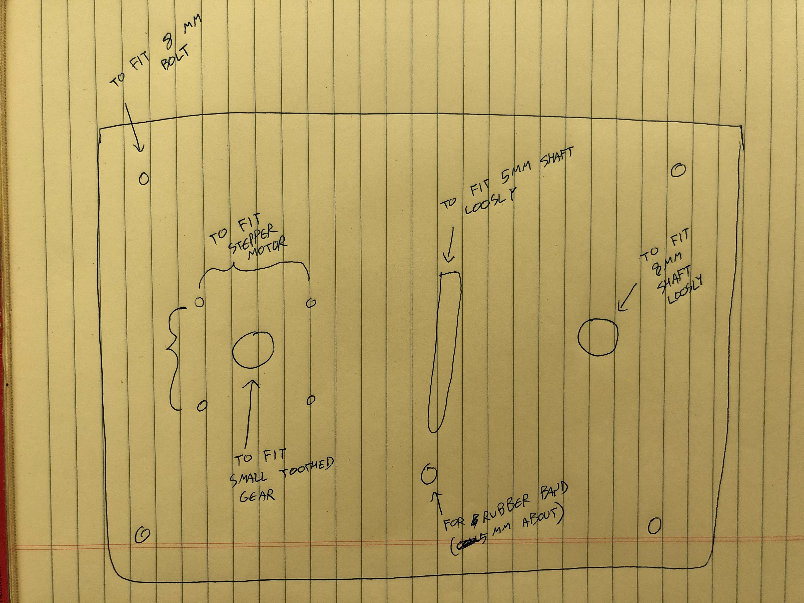
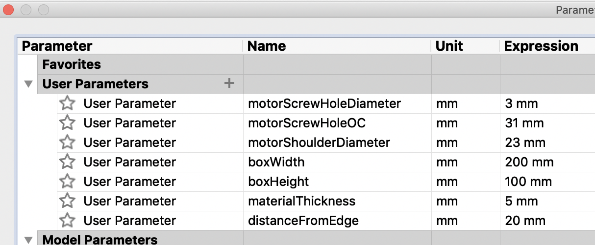

## New York University Abu Dhabi
## Interactive Media
# Machine Lab
### Course Number: IM-UH 2113
### Spring 2020

**Everything can be found on the course website:**
[https://github.com/michaelshiloh/MachineLab](https://github.com/michaelshiloh/MachineLab/)

# Schedule, Lectures, and Assignments

This schedule is subject to change

#### Wednesday 29 January 2020 11:50 AM - 1:05 PM
- What this class is about (schedule)
- About me
	- Artist, maker, engineer, educator
	- Interests: Metal, microcontrollers , machines (e.g. [srl.org](sr.org) warning: some images may be disturbing)
	- Robots: Telepresence, personality
	- Questions: Robotic intentionality, research participation, who learns technology
- About you
- Syllabus
- Summary:
  -  Be present and participate in class
  -  No electronic distractions
  -  Be proactive: Communicate with me regarding difficulties, problems, illness, etc.
  -  Allow lots of time for homework as physical construction
  and debugging circuits and programs can be very time consuming.
- Announcements
  - Become a lab assistant! The
		[application](https://app.joinhandshake.com/jobs/3061261/edit?initial_page=4) deadline is Feb 3rd at 11:59 pm.
	- Room access
		[form](https://docs.google.com/forms/d/e/1FAIpQLSceQTn7jmNmIAvgEpJQwKjIezsKwuxA6esxtEPW2lNVZHt_dw/viewform)
- Questions:
	- Do you prefer all lectures in [one
		page](https://github.com/michaelshiloh/MachineLab/blob/master/spring2019/schedule.md) or a separate page for each day?
- Examples
	- [Whale Automaton](https://imgur.com/gallery/Vq2LU9k)
	- [Simple Cardboard Machines](https://vimeo.com/130539503)
	- [Drawing Machine](http://www.shihanzhang.com/drawing-machine/)
	- [Musical Instrument](https://vimeo.com/189366071)
	- [Chain Reaction](https://vimeo.com/102887278)
	- [Marble
		Machine 1](https://www.pinterest.cl/pin/481251910156036553/visual-search/?x=12&y=12&w=405&h=512)
	- [Marble Machine 2](https://www.youtube.com/watch?v=09BVLbyWAqQ)
	- [Marble Machine 3](https://www.youtube.com/watch?v=Bpdb8yQ9cH8&t=28s)
	- [Machinations-Mechanisms](https://github.com/michaelshiloh/resourcesForClasses/blob/master/doc/machinations-mechanisms.pdf)
	- [Creative Machine Lab at Columbia University](http://www.creativemachineslab.com/)
	- [Rolling Ball Machine made of Bicycle Junk](https://www.youtube.com/watch?v=Bpdb8yQ9cH8)
	- George Rhoads' [Ball Machines](http://georgerhoads.com/)
	- Creative Architecture Machines [here](http://www.creative-architecture-machines.net/) and [here](http://www.future-cities-lab.net/blog/2013/11/3/creative-architecture-machines-cca-fall-2013)
	- Harvey Moon's [Drawing Machines](https://creators.vice.com/en_au/article/nz4jj7/harvey-moons-drawing-machines)
	- Jean Tinguely
	- [Alan Rath](http://alanrath.org/)
	- John Cage
	- [Theo Jansen](http://www.strandbeest.com/)
- Demo
- Let's start making something

#### Homework due Monday February 3 
- **Read**
	- [Machinations-Mechanisms](https://github.com/michaelshiloh/resourcesForClasses/blob/master/doc/machinations-mechanisms.pdf)
	- [Basic
		Mechanisms](https://web.archive.org/web/20170727010622/http://www.mechanical-toys.com/mechanisums.htm)

- **Do**
	- Start building your hand crank machine using a crank and any 
		other mechanism (linkage, cam, etc.). It is fine to copy my example.
		You don't need to finish this project by Monday, but I do want you to 
		find out where you have problems

- **Optional**
	- Browse [Mechatronics
 Resources](https://github.com/michaelshiloh/resourcesForClasses#mechatronic-resources)

## Monday 3 February 2020 10:25 AM - 1:05 PM

**Share Projects**
- What did you learn?

**Demonstration**
- Cardboard construction techniques

**Demonstration**
- Soldering pins to scrap boards
	- Nice cone
	- Not too much, not too little solder
- Soldering pins to shields
	- Keep pins straight
	- Keep solder away from length of pins

#### Homework due Wednesday February 5 

1. Finish your hand crank machine, using the feedback you received in class
	 today
1. Download and install the [Arduino
	 IDE](https://www.arduino.cc/en/Main/Software) (not the web editor)
1. If you are new to Arduino read the following:
	1. Arduino basics: Intro through Lesson 3 of Adafruit's Arduino
		 [tutorial](http://www.ladyada.net/learn/arduino/index.html)
	1. The first four tutorials from
		 [here](https://github.com/michaelshiloh/resourcesForClasses#basic-arduino-resources-from-arduino)

## Wednesday 5 February 2020 11:50 AM - 1:05 PM

Look at projects

**Do Along with Me**
- Arduino

#### Homework due Monday February 10 
(revised Feb 6)

1. If you've never used it before,
	learn about the Adafruit motor shield by reading the sixth resource
	[here](https://github.com/michaelshiloh/resourcesForClasses#motors-resources).
	Don't worry about all the details, just get the general picture.
1. Create a github account (if you don't have one) and a repository 
	for this class by following the first resource 
	[here](https://github.com/michaelshiloh/resourcesForClasses#github-resources).
	1. Name the repository "machineLab".
	1. Email me a link to your repository
1. If you don't have Google Chrome browser on your laptop, install it from
	 [here](https://support.google.com/chrome/answer/95346?co=GENIE.Platform%3DDesktop&hl=en)

## Monday 3 February 2020 10:25 AM - 1:05 PM

**Administration**
- Label shelves

**Be excellent to the lab**
- It is super critical to keep tools, parts, and the lab in general neat.
- If tools or parts can't be found it's the same as them not existing and it
	holds everyone up including me
- If you don't know where something goes ask me or a lab manager or a lab
	monitor. If no one in the lab knows leave it on your shelf and send me
	email.
- Always (**Always!**) leave the lab cleaner than you found it. Clean up 
whatever mess you made, and a little more
- We are going to be making more stuff than any other class, so if there
    is a mess, everyone will know it's us.
- If I find out that you are being a bad lab citizen, it will affect your
	grade

**Do Along with Me**
- Motor Shield
- Stepper motor

**Time Permitting**
- Circuits
- Voltage and Current
- Transistors and Motors

**Creating a design for the laser cutter**

#### Homework due Wednesday February 12

Do your best to create the design I sketched on the board for the laser cutter.
The purpose of this assignment is not necessarily to finish the design
perfectly, but to get practice using Illustrator. You will need holes for the
following:

1. Stepper motor mounting holes and shaft hole. 
	1. The stepper motor details are
	 [here](https://cdn-shop.adafruit.com/product-files/324/C140-A+datasheet.jpg)
	1. You will need 5 holes: 4 for the mounting screws, and one for the shaft
		 in the middle.
1. An 8mm rod at a suitable distance. 
	1. Use the gears and timing belt I showed you in class, and estimate
		what a suitable distance would be. Remember that you want the belt to be
		loose, so that the idler pulley has something to do. It doesn't matter
		which gears and belt you use; again, this is just to learn the process.
1. A slot that a 5mm rod can move in. This is for the idler pulley, and it
	 needs a slot so that it can move towards the belt
1. 4 mounting holes in the corners to attach your structure to something.
	 Placement is not critical.

#### Homework due Monday February 17

1. Read [Motors and Selecting the Right
	 One](https://learn.sparkfun.com/tutorials/motors-and-selecting-the-right-one)
1. Read [this](images/machineArtInTheTwentiethCentury.pdf) selection from Machine Art In The Twentieth Century
	1. Chose one of the authors, artists, concepts, or other topics to research
		 and on which to give a short (5 minute) presentation. We will chose dates
		 later.
1. Finish your design for the laser cut project. 
	- Remember to enlarge the hole in the middle of the stepper motor to allow
		for the wide shoulder of the motor. It should be about 23mm in diameter.
	- Remember that now we have both a front and a back
	- Book an appointment on the laser cutter
	- You will first cut your project from cardboard. Make sure all the parts
		fit, and then cut it out of acrylic.
		- Stepper motor
		- 8mm shaft
		- 5mm shaft
		- hole for rubber band
		- 4 holes in the corners for the long bolts
	- If you want to fit everything together, I left the long bolts in our
		special rolling cart, in the bin with the USB cables.

## Monday 17 February 2020 10:25 AM - 1:05 PM

- Dates for presentations
- Work on mechanism

#### Homework due Wednesday February 19 
1. Modify your design for the laser cut acrylic pieces so that the belt 
can be properly tentioned. Remember what I suggested in class, of making
a number of holes so that you can adjust the distance to the 8mm rod.
1. Book an appointment with the laser cutter (do this now, before 
the appointments are taken) and cut your new pieces of acrylic
1. Assemble your mechanism and test that the motor can turn the 8mm shaft
	 reliably

## Wednesday 19 February 2020 11:50 AM - 1:05 PM

- Look at homework
	- How would we mount this on a wooden base?
		- Acrylic drill bits
- Servo motors
	- How would we mount these?
		- Tiny screws
		- Wood?
		- Acrylic?
		- Aluminium?
- Controlling servo motors
- Inputs and outputs, digital and analog
- Multitasking
- Using a switch to start a sequence

#### Homework due Monday February 24

1. Read, and try to understand, [Multi-tasking the Arduino, Part
	 1](https://learn.adafruit.com/multi-tasking-the-arduino-part-1?view=all)
1. The code for the stepper motor, switch, and potentiometer is
	 [here](src/stepperMotorPotAndSwitch/stepperMotorPotAndSwitch.ino)
1. Remember to dress for the Scene Shop training: closed toes shoes, long
	 pants, no loose sleeves, tie back long hair

## Monday 24 February 2020 10:25 AM - 1:05 PM

1. 10:25 - 11:15am: Try to understand, [Multi-tasking the Arduino, Part
	 1](https://learn.adafruit.com/multi-tasking-the-arduino-part-1?view=all)

1. 11:15am - 11:30: Break

1. 11:30-1pm Scene shop training

#### Homework due Wednesday February 26

1. Read about linkages in
	 [this](https://github.com/michaelshiloh/resourcesForClasses/blob/master/doc/howToDesignAndMakeAutomata_RobertAdams.pdf)
	 or
	 [this](https://github.com/michaelshiloh/resourcesForClasses/blob/master/doc/howToDesignAndMakeSimpleAutomata_RobertAdams.pdf)
	 (I think they are two versions of the same book. If you prefer video
	 tutorials there are many online, Google for something like "linkages
	 tutorials" (If you find any good ones let me know.)

1. Read and try to understand
	 [toneMelodyAndBlinkWithoutDelay](https://github.com/michaelshiloh/toneMelodyAndBlinkWithoutDelay/blob/master/toneMelodyAndBlinkWithoutDelay.ino). 
	 There are some new concepts here: the tone() command and the concept of an
	 array. If these are new to you please Google "Arduino Tone" and Arduino
	 Array" and read about these. I will go over this in class, but do your best
	 to prepare.  (Note that this example does not use a class; that would be
	 the next stage.)

1. Sketch a design for some sort of mechanical contraption 
that uses the stepper motor, servo motor, and linkages. This can be hand
drawn. Don't make this too complex, and don't worry about making this too
detailed as it will probably change.
We will work on this together next week in the Scene Shop.

	1. Make a new folder in your Github repository called "midterm"  

	1. In the new folder "midterm" create a file called "readme.md"

	1. Upload a picture of your sketch to the same folder

	1. In the file "readme.md" include the picture

	1. If you need some help with github, look
	[here](https://github.com/michaelshiloh/resourcesForClasses#github-resources).
	You can also look at this file (click the "raw" button) 
	to see how I've included images

1. Remember that on Wednesdays we will have our student presentations. This
	 week Tonia will present on Russian Constructivism

## Wednesday 26 February 2020 11:50 AM - 1:05 PM

**Presentations**

Tonia: Russian Constructivism

**Projects**

Review sketches for projects

#### Homework due Monday March 2

1. Improve your design

	1. Take into account whatever feedback I gave you. Many of you have to
		 simplify your designs.

	1. Add more details. Think about how things will be held in place and 
		what supports you need. Remember what you learned while working on
		your cardboard automata. Consider constraints and alignment.

	1. Add dimensions

	1. Your design will probably still change, but you should be ready to start 
		cutting and drilling on Monday

	1. Upload your revised plan to your Github page

1. Browse chapters 1, 3, 7, and 8 of [Making Things
	 Move](https://github.com/michaelshiloh/resourcesForClasses/blob/master/doc/making_things_move.pdf)

1. Read about [limit switches](https://en.wikipedia.org/wiki/Limit_switch)

1. Dress appropriately for the Scene Shop 

## Monday 2 March 2020 10:25 AM - 1:05 PM

1. Construction techniques
1. Scene Shop: Working with wood

#### Homework due Monday March 16

Complete your midterm project and documentation:

1. Mechanical contraption that uses the stepper motor, 
servo motor, and linkages. 

	1. Don't make this too complex.

	1. Mechanisms, Arduino, breadboard, and any power supplies must be
	firmly mounted on some sort of platform (cardboard and hot glue is OK, 
	wood is better)

	1. Wires well organized and routed

	1. Any wires that go off the platform must be firmly attached to 
	platform

1. Description of project in README.md in the midterm folder including:

	1. Concept description

	1. Concept sketch

	1. Photographs

		1. Overall project

		1. Close up of mechanisms

	1. Schematic, which can be hand drawn
	
	1. Arduino program, including

		1. Good comments

		1. Good variable names

		1. Properly indented using <CMD>t

## Wednesday 4 March 2020 11:50 AM - 1:05 PM

Student presentation: 

Sadeq: Francis Picabia 

Presentation by Tobias

## Friday 6 March

**Plan moving forward**

As you all realize the health situation is going to affect the way this course
is delivered. I hope that after the 4 weeks are up we can return to the lab
and the scene shop and do more building.

Meanwhile, we will continue to develop our projects as much as we can
virtually. I plan to deliver further training using online methods, probably
Zoom, which is integrated in NYU Classes.

To continue designing and testing mechanical contraptions, we will utilize
[Fusion
360](https://www.autodesk.com/products/fusion-360/students-teachers-educators).
Much more than Illustrator, Fusion 360 allows you to model components of
mechanisms and then to animate them, in other words to simulate actual
mechanisms.
This will allow us to develop concepts, and will prepare us for the final
project.

I will assign you to read/watch some Lynda tutorials to prepare you for
working with Fusion 360.

Since we are moving entirely online, you do no need to
take any of your equipment to your room. However, I do want you to thoroughly 
document
the current state of your mechanism by taking careful pictures of all aspects
of your work so far. If it is not yet assembled, take pictures of whatever
parts you have prepared. Organize them as closely as possible to how you
planned to assemble them.

**As you've read, tomorrow (Saturday March 7) is the last day you will have
access to the IM lab. It is thus important that you take these pictures
immediately.**

I will write further regarding how I want you to document your project and
when this documentation is due. For now, just take lots of pictures.

#### Revised Homework due Monday March 16

**Do and Watch**

We will be learning how to use Fusion 360 to create our designs.
Fusion 360 is a powerful Computer Aided Design (CAD) system
which is free for educational uses.

1. Download and install Fusion 360 from
	 [here](https://www.autodesk.com/products/fusion-360/students-teachers-educators#).

	 1.1. You will be required to make an account. 
	 When asked for name of educational
	 institution chose New York University, New York.

	 1.1. After logging in, you will be given access to Fusion 360, 
	 which you can then download and install.

1. Watch the following sections from 
[Fusion 360 Essential
Training](https://www.linkedin.com/learning/fusion-360-essential-training-2/use-fusion-360-to-turn-your-ideas-into-designs)

	1.1. Optional: Section 1: Introduction to Fusion 360

	1.1. All videos in section 2: Creating Basic Shapes

	1.1. All videos in section 3: Planning Your Design

#### Monday March 16 (10:25 - 1:05)

A recording of our class discussion today can be found i  
1. Visit our course in classes.nyu.edu  
1. Click on Zoom from the options on the left  
1. Select the Cloud Recordings tab  

#### Homework due Wednesday March 18

1. Do your best to create the design we made with Illustrator (diagram above).
The purpose of this assignment is not necessarily to finish the design
perfectly, but to get practice using Fusion 360. 
Remember to use parameters for all dimensions.
You will need holes for the following:
	1. Stepper motor mounting holes and shaft hole. 
		1. The stepper motor details are
		 [here](https://cdn-shop.adafruit.com/product-files/324/C140-A+datasheet.jpg)
		1. You will need 5 holes: 4 for the mounting screws, and one for the shaft
			 in the middle.
	1. An 8mm rod at a suitable distance. 
		1. Use the gears and timing belt I showed you in class, and estimate
			what a suitable distance would be. Remember that you want the belt to be
			loose, so that the idler pulley has something to do. It doesn't matter
		which gears and belt you use; again, this is just to learn the process.
	1. 4 mounting holes in the corners to attach your structure to something.
		 Placement is not critical.
1. Browser the [McMaster-Carr]() website a little 
	1. See if you can find the timing gears that we used. 
	1. See if you can attach a gear to the motor shaft.
1. Document as best you can the work you did for the midterm project (due
	 Monday March 30)

#### Wednesday March 18 (11:50 - 1:05)

Continue working on your design, practice using Fusion 360. Here are the
parameters I used, you don't have to do the same:

#### Homework due Monday March 30 

Some of you made excellent progress, others less so. Some of you appear
to have not put in much time. Learning CAD takes time, and the 
only way to get good at it is to put in the time. 

1. Watch the following tutorials: 
	1. https://www.youtube.com/watch?v=C03H_YZHuAI
	1. https://www.youtube.com/watch?v=QisfRW0pd44
	1. https://www.youtube.com/watch?v=Bw08O6XsfDI
1. Finish your design. Add the following:
	1. Four bolts to hold the two halves together (MCM # 91280A396)
	1. Nuts (MCM # 90591A151) as needed, joined to the proper surfaces
	1. Pulley for motor (MCM # 3684N11)
		1. I couldn't find a bigger pulley for the 8MM shaft, so not needed
	1. 8mm shaft. Design your own since the only one MCM carries 
		(# 1265K68) is almost a meter long!
1. Upload your documentation for the midterm project to Github
	1. Create a folder called "midterm"
	1. Upload images
	1. Create a README.md file, in which you describe your project and include
		 the pictures

#### Monday March 30 (10:25 - 1:05)

**Mental health checkin**

**Let's see your designs**

**Joints**

**What can we design in Fusion 360 that can be fabricated?**

Fabrication tools that we have access to

1. 2D cutting tools
	1. Laser cutter (plastic, cardboard, some wood)
	1. [Water jet cutter](https://www.youtube.com/watch?v=sIEqXbXxpfg) (anything that can be submerged in water)
	1. [Wire EDM cutter](https://www.youtube.com/watch?v=B5ImnweEuSM) (anything conductive)
	
1. 3D additive tools
	1. 3D printer
		1. [Plastic](https://www.youtube.com/watch?v=82ZZVIl72yE+2:55)
		1. [Metal](https://www.youtube.com/watch?v=te9OaSZ0kf8+1:15)
		
1. 3D subtractive tools
	1. [Manual lathe](https://www.youtube.com/watch?v=Vm5Chb_2JxA+2:02) (plastic, metal)
	1. [Manual mill](https://www.youtube.com/watch?v=5ZkP5RW41rg+17:28) (plastic, metal)
	1. 3 axis [CNC router](https://www.youtube.com/watch?v=KyAsqOvmTGE) (wood, plastic, soft metal) (often mistakenly abbreviated "CNC")
	1. 5 axis [CNC mill](https://www.youtube.com/watch?v=vMY06dzf7UA) (hard metals)

What happens if you go too fast or too deep? For fun, here are some [CNC Crashes, Breaking Tools, & Outtakes](https://www.youtube.com/watch?v=j0ME__3RwWQ)

**Final project**

Inspiration

1. [Munich town hall clock](https://www.youtube.com/watch?v=fgbFr9-fYJc]
1. [Goslar's Marktplatz Animated Clock](https://www.youtube.com/watch?v=ijAjS8K-NVU)
1. [Swiss Music Clock or Swiss glockenspiel in Leicester Square](https://www.youtube.com/watch?v=x0denYIr-QU)
1. [Messina Bell Tower](https://www.youtube.com/watch?v=rqP_8F4ujr4)
1. The [Peacock Clock](https://www.youtube.com/watch?v=ilPlVRoUl_8)
1. [Automaton Clock in the Form of Diana on Her Chariot](https://www.youtube.com/watch?v=u6ro4zscyE0)
1. Tim Hunkin's [clock at the London Zoo](https://www.youtube.com/watch?v=-i7kvH-zFkQ)
1. Tim Hunkin's [clock at the Exploratorium in San Francisco](https://www.youtube.com/watch?v=AUKN-0fSiNo)

Concept

1. Overall theme
1. Electronic timekeeping
1. Display time (mechanical)
1. Animations at regular intervals
	1. 15, 30, 60? or why be normal?
	
Discussion

1. Dimensions
	
#### Homework due Wednesday April 1

1. Follow along with the three joint videos and make those joints (due Monday
	 April 6)
1. Watch the inspiration videos above. Pay attention to the mechanisms and the
	 movements.
1. Suggest 3 possible themes
1. Hand draw a very rough sketch of your mechanism that will be part of the clock. Upload to github, in a new folder called "finalProject"

#### Homework due Wednesday April 1

#### Wednesday April 1 (11:50 - 1:05)

**Final Projec**

* We will make a clock
* Michael will make the timekeeping part and the frame
* Each one of you will make a mechanism that reflects something you are
	excited about or is representative of you. This could be a hobby or
	something that you enjoy doing. 
* Be creative. Inspiration can come from the cardboard project that we did at
	the beginning of class, the clocks that I linked above, or anything else.
	Please share interesting resources.
* The size is flexible, but keep in mind the limitations of the motors 
that we have.
* The frame will be out of metal and reasonably strong
* You mechanism must have a metal base which will be bolted to the frame
* Your mechanism should include your Arduino which will control the behavior
	of your mechanism
* Your mechanism should have different levels of activity e.g. a low level
	which might be activated on the quarter hour, a medium level on the half
	hour, and a high level which will be activated on the hour. You can have as
	many levels as you want, and you can choose when you want them activated
	(will will discuss this further). 
* The main clock will send you signals for the different times that you want
	to be activated
* Leave room on your base for your power supplies, e.g. one for your Arduino
	and one for your motor (and possibly a third if you have a motor with a
	different voltage e.g. servo motor).

The goal is to get all parts designed and fabricated this semester, and then
next fall we will assemble the clock

#### Homework due Monday April 6

* Preliminary sketch of your mechanism
* Think about the following in as much detail as you can:
	* The base and how things will be attached to it
	* What motors you need
	* How will your parts will be fabricated
	* What materials your parts will be made from. (aluminum, steel, acrylic)
	* The different levels of activity 
* If you need parts that we don't have, use parts from McMaster Carr. We can
	order those easily and you get the CAD model.
* Follow along with the three joint videos and make those joints 

#### Monday April 6 (10:25 - 1:05)

* Limit switches 
* [Big
	motors](https://www.amazon.com/uxcell-Reversible-Turbine-Electric-Gearbox/dp/B071KSMKYN/)
* Any questions or problems with joints?
* Take a look at your proposed mechanisms
* In-class work time: start constructing your mechanism

[Drawing machine using cams](https://www.youtube.com/watch?v=pokSViy6Eck) (for
Alyazia)

#### Homework due Wednesday April 9

I want to see progress every time we meet. In order to demonstrate your
progress, you will keep a journal for your final project.

1. If you have not done so, create a new folder in your Github repository
	 called "final" or "finalProject"
1. In this new folder create a file README.md (if you've not already done so).
	 This will be your journal
1. In your journal, include the pictures of what you had prepared for Monday.
1. Your assignment for Wednesday is to refine your design, adding details.
	 Think about the following for each piece. You don't need to have all the
	 answers yet, but for as many as you can:
	1. Dimensions
	1. What materials you will use for each piece?
	1. How will you design it in Fusion 360?
	1. What machine will be used to fabricate each piece?
	1. How each piece will attach to the rest? Glue? Bolts? 
1. Put the date separating each section so I can tell what you have done
	 before, and what is new today.

#### Monday April 13 (10:25 - 1:05)

**Announcements**

We are planning a virtual end-of-semester showcase which will tentatively happen in conjunction with New York ITP/IMA on **May 17th, 8–10pm GST**. (New York is doing it on both 17th and 18th. We will be joining only on the 17th and Shanghai will be joining only on the 18th.)

You are all encouraged to participate. If you want to participate you will be responsible for:

* Creating your own online presence for your final project. This can be on any platform: WordPress, Github, Wix, whatever you chose

* Entering your project information into the ITP Project Database (title, description, link to online presence, etc)

* Being live on Zoom during the event (either set up your own Zoom session or join a Zoom session that faculty hosts, to be decided)

Would you be interested in participating?

[Online ruler](https://www.ginifab.com/feeds/cm_to_inch/actual_size_ruler.html) for when you're working at home and don't have a real ruler. Thanks to Alyazia!

#### Wednesday 15 April 2020 11:50 AM - 1:05 PM

**Record Zoom!**

**Announcements**

1. Student presentations - who did I forget?

	* Max: Pierre Jaquet Droz April 1  
	* Ivory: Machine Art exhibition at MoMA (1934) April 8

**Student Presentation**

Will: Jean Tiguely 

#### Homework due Monday April 20

1. Put your presentation in your Github repository

1. Continue to refine your design. Have at least one piece ready for
	 fabrication. 
	 Send me the files and I will forward them to the machine shop.
	1. Sketches to be laser or waterjet cut should be exported as DXF files
	1. Bodies for 3D printing should be exported as STL files.

#### Monday April 20 (10:25 - 1:05)

**Student Presentation**

Max: Pierre Jaquet Droz

Thank you Max for your presentation on those amazing automatons

Thank you all for attending class and showing your work today. I see good
progress.

The people fabricating our parts are having trouble getting our files
from Github, so here is the correct procedure:

1. Put your STL (for 3D printing) or DXF (for laser cutting) files into a Google Drive folder. 
1. If you have both STL and DXF files put them in separate folders
1. Email me with the link(s)
1. I will forward your links to the appropriate people, and copy you.

On Wednesday Carlos will present on  Meyerhold 

#### Monday April 27 (10:25 - 1:05)

Ramadan Kareem everyone! 

1. Note to self: Record the meeting
1. I have consulted with other faculty and we have decided that the work you show in the virtual showcase should be from this class only, and should not include other work you have done. However, you can show any and all work that you have done in this class.
1. I realize that Fusion is tricky to learn, and some of us do better with hand drawings or using other programs. You are allowed to use whatever system works best for you.
1. No eating in class out of respect for Ramadan
1. We have a presentation by Ivory today
1. On Wednesday Alyazia will present

Here are the links that were used in class today:

1. 3D printed [snap-fit pivots](http://eikimartinson.com/engineering/3dparts/#pivot) found by Vince. 
This page includes information about 3-D printing threads and a dovetail joint, useful for attaching 
pieces together at right angles without screws.
1. 3D printed [hub](https://grabcad.com/library/clamping-hub-for-5mm-shaft) found by Alyazia
1. [Another](http://yeggi.com) and [another](https://www.stlfinder.com/) source for 3D models. 
Found these while searching for shaft couplers and servo motor mounts. Note these are just search engines
which find the models on other sites, such as [Thingiverse](https://www.thingiverse.com/).
1. [This](https://grabcad.com/library/57335) looks like a model for the high-torque gearmotor we have, although I can't be sure.

#### Monday May 4 (10:25 - 1:05)

**Announcements**

1. Zoom meeting ID 426-158-513
1. Record meeting
1. Fatima: Jacques de Vaucanson May 6

**Virtual Showcase deadline Friday May 8:**

If you want to participate in the Spring 2020 Abu Dhabi, 
Shanghai,and New York City Virtual Showcase, you must enter initial
information about your project into the 
[projects database](https://itp.nyu.edu/projects/) by Friday May 8.
You'll associate your project with the venue "The Virtual Show Spring 2020".

[Here](https://youtu.be/TNjf2i1Ioq4)
is a video on how to enter your project. 
The video mentions adding a Zoom link. You can ignore this because NYUAD
is not participating in the live Zoom portion of the event.

Details to follow on how visitors can access the showcase.
Since it's virtual, this is the first time a showcase is not restricted to 
local visitors. 

**Class Notes**
1. To copy a component, you first need to convert it to a body 
1. [Shaft coupler for two different sized
	 shafts](https://www.thingiverse.com/thing:245023)
1. Servo motor models, various options: [this(https://grabcad.com/library/mg90s-servomotor-1)
, [this](https://gallery.autodesk.com/projects/132949/sg90-9g-micro-servo)
, or
[this](https://gallery.autodesk.com/fusion360/projects/136284/servo-motor-sg90)
.
1. Stepper motor size is NEMA 17. Different motors might have different
lengths, but they all have the same width, height, and shaft diameter.
Our motors are either from [Adafruit](https://www.adafruit.com/product/324)
or [Sparkfun](https://www.sparkfun.com/products/9238).
Both have datasheets which is where you find the precise dimensions.
1.
[Bracket](https://www.stlfinder.com/model/wormgear-dc-motor-bracket-S50zOReE/7787353/)
for the [high-torque worm gear drive
motor](https://www.amazon.com/ELEGOO-28BYJ-48-ULN2003-Stepper-Arduino/dp/B01CP18J4A)

#### Virtual Showcase initial entry due May 8

For those of you who are participating in the virtual global showcase:

* You may make changes later, this initial entry is just to set things up

* [Here](https://youtu.be/TNjf2i1Ioq4)
is a video on how to enter your project. 

* If you can’t access the video on YouTube, 
[here](https://drive.google.com/file/d/1tKcRj2NXWoHqD14my0eymT2aohKfymg0/view)
is a copy on google drive

* The video mentions a Zoom link. Ignore this part as we are not participating in the Zoom segment

* Enter your information in the 
[projects database](https://itp.nyu.edu/projects/). 
Log in with your NYU credentials.

* You’ll associate your project with the venue “The Virtual Show Spring 2020”

* You will need to create an online site for your project (can be your Github site), submit a 30 second video about your project, and write a 250-300 word description so I suggest you start now

* You may continue to edit and update your entry until the last minute, but you should have everything finalized by May 16.

#### Final Project documentation due May 14

In your finalProject folder:
1. Journal (in a file called README.md)
	1. Overview: What this project is, how it will operate in the context 
	of the clock, and an overall picture (hand-drawn or CAD)
	1. Your journal is a record of your work on this project
	from the first drawings that were due on April 6. 
	1. I want to see the progression from the first rough sketches 
		to the design that you have now.
	1. Describe the changes that you make to your design and why you make them
	1. Discuss the various things you learned on the way. 
	1. Discuss the difficulties you ran into, and how you resolved them
	1. Discuss how you decided which piece to fabricate by 3D printing,
	which pieces to fabricate by cutting with the laser cutter, and any
	other tools
	1. Discuss how your mechanism will be assembled
	1. Discuss what other components or materials you will need when the project
		 is assembled
	1. Discuss any remaining problems or concerns

Wednesday

	Course evaluations  (in class)
